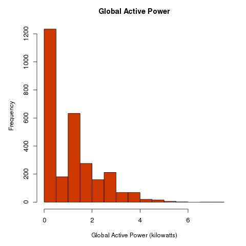
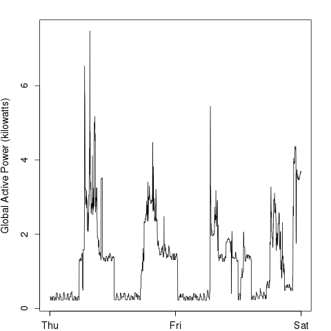
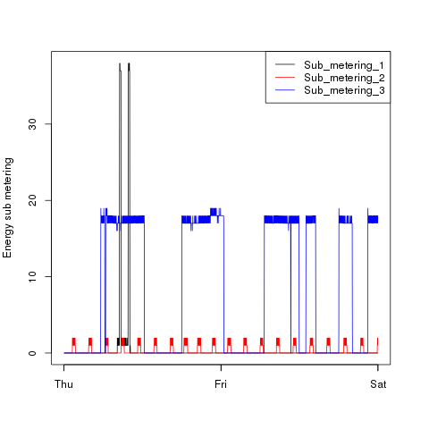
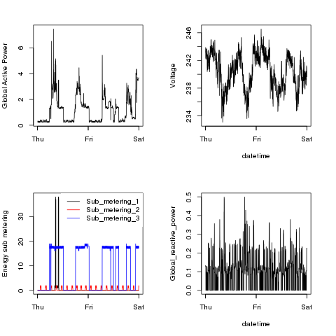

## [Exploratory Data Analysis - JHU](https://class.coursera.org/exdata-003), via [Coursera](https://www.coursera.org/)  
## My solution to Course Project 1

### Introduction  
**Welcome!**  
In this page you'll find my solution for the first assignment in this
course: *Course Project 1*.  

### Plot 1  
+ The R code file [`plot1.R`](https://github.com/dpoet/ExData_Plotting1/blob/master/solution/plot1.R) constructs `plot1.png`, below:      
  

### Plot 2  
+ The R code file [`plot2.R`](https://github.com/dpoet/ExData_Plotting1/blob/master/solution/plot2.R) constructs `plot2.png`, below:      
  

### Plot 3  
+ The R code file [`plot3.R`](https://github.com/dpoet/ExData_Plotting1/blob/master/solution/plot3.R) constructs `plot3.png`, below:      
  

### Plot 4  
+ The R code file [`plot4.R`](https://github.com/dpoet/ExData_Plotting1/blob/master/solution/plot4.R) constructs `plot4.png`, below:      
  
